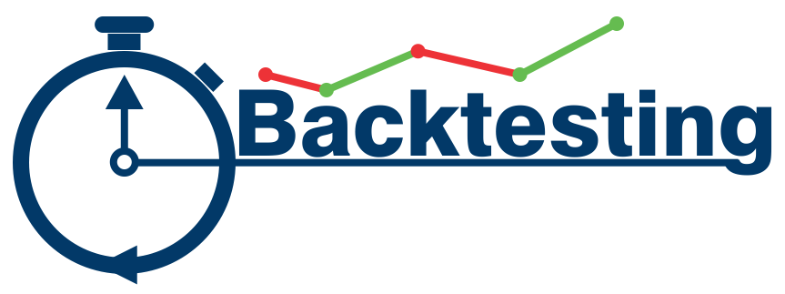
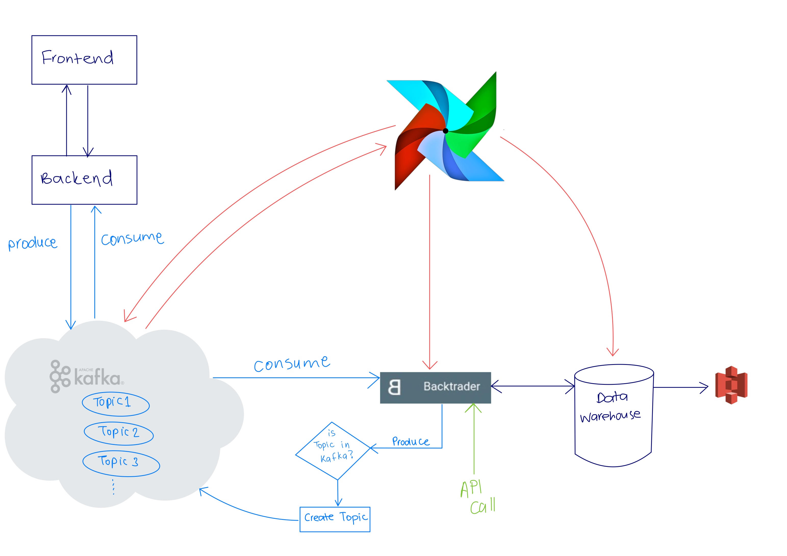

## Scalable-backtesting-pipeline
Design and build a reliable, large-scale trading data pipeline so important for financial systems. 
Although the past performance of any financial market is never a reliable indicator of the future, it is important to run backtests that simulate current and past particular situations as well as their trend over time. Having a clear understanding of the financial system, stock market trading,  and recognizing the complex data engineering systems involved in the crypto and general stock market trading systems are essential.
## Data Capture Pipeline

## Run Locally

Clone the project

```bash
  git clone https://github.com/g3-reiten/scalable-backtesting-pipeline
```

Go to the project directory

```bash
  cd scalable-backtesting-pipeline
```

Install dependencies

```bash
  pip3 install -r requirements.txt
```

Set up pipeline

```bash
  python3 setup.py
```

## Contributors

- [Haylemicheal](https://github.com/Haylemicheal)
- [Janerose](https://github.com/KaydeeJR)
- [Mohammed](https://github.com/MohammedEsamaldin)
- [Nahom](https://github.com/nahomHmichael)
- [Patrick](https://github.com/prubayita)
- [Wangui](https://github.com/akrobi)
- [Yonas](https://github.com/yonamg)

